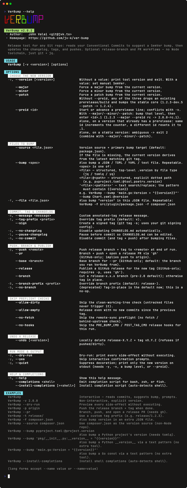

# ver-bump

**A pure-bash release tool for any Git repo.**

- **Suggests the right bump** — reads your [Conventional Commits](https://www.conventionalcommits.org/) to propose the next [SemVer](https://semver.org/), prereleases included
- **Writes the changelog** — flat or grouped by commit type, with commit / PR / compare links
- **Bumps any file** — `package.json`, `pyproject.toml`, `Chart.yaml`, a Go const, any `{{version}}` text pattern
- **Three workflows** — tag in place, cut a release branch, or open a GitHub PR
- **Safe by default** — preflight checks, `--dry-run` previews every side-effect, `--undo` rolls back
- **Nothing to install but bash** — `git` and `jq` are the only runtime dependencies

<div align="center">

[![!#/bin/bash](https://img.shields.io/badge/-%23!%2Fbin%2Fbash-1f425f.svg?logo=image%2Fpng%3Bbase64%2CiVBORw0KGgoAAAANSUhEUgAAABgAAAAYCAYAAADgdz34AAAAGXRFWHRTb2Z0d2FyZQBBZG9iZSBJbWFnZVJlYWR5ccllPAAAAyZpVFh0WE1MOmNvbS5hZG9iZS54bXAAAAAAADw%2FeHBhY2tldCBiZWdpbj0i77u%2FIiBpZD0iVzVNME1wQ2VoaUh6cmVTek5UY3prYzlkIj8%2BIDx4OnhtcG1ldGEgeG1sbnM6eD0iYWRvYmU6bnM6bWV0YS8iIHg6eG1wdGs9IkFkb2JlIFhNUCBDb3JlIDUuNi1jMTExIDc5LjE1ODMyNSwgMjAxNS8wOS8xMC0wMToxMDoyMCAgICAgICAgIj4gPHJkZjpSREYgeG1sbnM6cmRmPSJodHRwOi8vd3d3LnczLm9yZy8xOTk5LzAyLzIyLXJkZi1zeW50YXgtbnMjIj4gPHJkZjpEZXNjcmlwdGlvbiByZGY6YWJvdXQ9IiIgeG1sbnM6eG1wPSJodHRwOi8vbnMuYWRvYmUuY29tL3hhcC8xLjAvIiB4bWxuczp4bXBNTT0iaHR0cDovL25zLmFkb2JlLmNvbS94YXAvMS4wL21tLyIgeG1sbnM6c3RSZWY9Imh0dHA6Ly9ucy5hZG9iZS5jb20veGFwLzEuMC9zVHlwZS9SZXNvdXJjZVJlZiMiIHhtcDpDcmVhdG9yVG9vbD0iQWRvYmUgUGhvdG9zaG9wIENDIDIwMTUgKFdpbmRvd3MpIiB4bXBNTTpJbnN0YW5jZUlEPSJ4bXAuaWlkOkE3MDg2QTAyQUZCMzExRTVBMkQxRDMzMkJDMUQ4RDk3IiB4bXBNTTpEb2N1bWVudElEPSJ4bXAuZGlkOkE3MDg2QTAzQUZCMzExRTVBMkQxRDMzMkJDMUQ4RDk3Ij4gPHhtcE1NOkRlcml2ZWRGcm9tIHN0UmVmOmluc3RhbmNlSUQ9InhtcC5paWQ6QTcwODZBMDBBRkIzMTFFNUEyRDFEMzMyQkMxRDhEOTciIHN0UmVmOmRvY3VtZW50SUQ9InhtcC5kaWQ6QTcwODZBMDFBRkIzMTFFNUEyRDFEMzMyQkMxRDhEOTciLz4gPC9yZGY6RGVzY3JpcHRpb24%2BIDwvcmRmOlJERj4gPC94OnhtcG1ldGE%2BIDw%2FeHBhY2tldCBlbmQ9InIiPz6lm45hAAADkklEQVR42qyVa0yTVxzGn7d9Wy03MS2ii8s%2BeokYNQSVhCzOjXZOFNF4jx%2BMRmPUMEUEqVG36jo2thizLSQSMd4N8ZoQ8RKjJtooaCpK6ZoCtRXKpRempbTv5ey83bhkAUphz8fznvP8znn%2B%2F3NeEEJgNBoRRSmz0ub%2FfuxEacBg%2FDmYtiCjgo5NG2mBXq%2BH5I1ogMRk9Zbd%2BQU2e1ML6VPLOyf5tvBQ8yT1lG10imxsABm7SLs898GTpyYynEzP60hO3trHDKvMigUwdeaceacqzp7nOI4n0SSIIjl36ao4Z356OV07fSQAk6xJ3XGg%2BLCr1d1OYlVHp4eUHPnerU79ZA%2F1kuv1JQMAg%2BE4O2P23EumF3VkvHprsZKMzKwbRUXFEyTvSIEmTVbrysp%2BWr8wfQHGK6WChVa3bKUmdWou%2BjpArdGkzZ41c1zG%2Fu5uGH4swzd561F%2BuhIT4%2BLnSuPsv9%2BJKIpjNr9dXYOyk7%2FBZrcjIT4eCnoKgedJP4BEqhG77E3NKP31FO7cfQA5K0dSYuLgz2TwCWJSOBzG6crzKK%2BohNfni%2Bx6OMUMMNe%2Fgf7ocbw0v0acKg6J8Ql0q%2BT%2FAXR5PNi5dz9c71upuQqCKFAD%2BYhrZLEAmpodaHO3Qy6TI3NhBpbrshGtOWKOSMYwYGQM8nJzoFJNxP2HjyIQho4PewK6hBktoDcUwtIln4PjOWzflQ%2Be5yl0yCCYgYikTclGlxadio%2BBQCSiW1UXoVGrKYwH4RgMrjU1HAB4vR6LzWYfFUCKxfS8Ftk5qxHoCUQAUkRJaSEokkV6Y%2F%2BJUOC4hn6A39NVXVBYeNP8piH6HeA4fPbpdBQV5KOx0QaL1YppX3Jgk0TwH2Vg6S3u%2BdB91%2B%2FpuNYPYFl5uP5V7ZqvsrX7jxqMXR6ff3gCQSTzFI0a1TX3wIs8ul%2Bq4HuWAAiM39vhOuR1O1fQ2gT%2F26Z8Z5vrl2OHi9OXZn995nLV9aFfS6UC9JeJPfuK0NBohWpCHMSAAsFe74WWP%2BvT25wtP9Bpob6uGqqyDnOtaeumjRu%2ByFu36VntK%2FPA5umTJeUtPWZSU9BCgud661odVp3DZtkc7AnYR33RRC708PrVi1larW7XwZIjLnd7R6SgSqWSNjU1B3F72pz5TZbXmX5vV81Yb7Lg7XT%2FUXriu8XLVqw6c6XqWnBKiiYU%2BMt3wWF7u7i91XlSEITwSAZ%2FCzAAHsJVbwXYFFEAAAAASUVORK5CYII%3D)](https://www.gnu.org/software/bash/) [](https://github.com/jv-k/ver-bump/actions/workflows/ci.yml) [](https://www.codefactor.io/repository/github/jv-k/ver-bump) [](https://badge.fury.io/js/ver-bump) [](LICENSE)

<!-- TODO: revert to the main-pinned raw URL once the new images land on main -->


</div>

## Quickstart

### Install with curl (no Node required):

```sh
curl -fsSL https://raw.githubusercontent.com/jv-k/ver-bump/main/install.sh | bash
```

### Install from a registry (npm / pnpm):

```sh
pnpm add -g ver-bump
```

or

```sh
npm install -g ver-bump
```

### Manual install (clone and symlink):

```sh
git clone https://github.com/jv-k/ver-bump.git ~/.local/share/ver-bump
ln -s ~/.local/share/ver-bump/ver-bump.sh ~/.local/bin/ver-bump   # ensure ~/.local/bin is on $PATH
```

See [Installation](#installation) for checksum verification, version pinning, prefix options, and the planned Homebrew path.

### Use it in your repo folder:

```sh
cd your-repo
ver-bump --dry-run   # preview a release end-to-end, changes nothing
ver-bump             # cut it: reads commits, suggests a bump, prompts before pushing
```

## Demo

<div align="center">
  <!-- TODO: revert to the main-pinned raw URL once the new images land on main -->
  
</div>

## Table of Contents

<!-- START doctoc generated TOC please keep comment here to allow auto update -->
<!-- DON'T EDIT THIS SECTION, INSTEAD RE-RUN doctoc TO UPDATE -->
<details>
<summary>Details</summary>

- [Why `ver-bump`?](#why-ver-bump)
- [How it works](#how-it-works)
- [Features](#features)
  - [Misc Features](#misc-features)
- [Requirements](#requirements)
  - [Platform support](#platform-support)
- [Installation](#installation)
  - [Install script](#install-script)
  - [npm / pnpm](#npm--pnpm)
  - [Manual install](#manual-install)
  - [Homebrew](#homebrew)
  - [Basher](#basher)
- [Workflows](#workflows)
- [Migrating from 1.x](#migrating-from-1x)
- [Options](#options)
  - [Choosing the new version](#choosing-the-new-version)
  - [Bumping files](#bumping-files)
  - [Commit, tag & changelog](#commit-tag--changelog)
  - [Push, branch & publish](#push-branch--publish)
  - [Skip preflight checks](#skip-preflight-checks)
  - [Undo, run mode & help](#undo-run-mode--help)
- [Configuration](#configuration)
  - [Grouped changelog (`CHANGELOG_STYLE=grouped`)](#grouped-changelog-changelog_stylegrouped)
  - [Commit message template (`COMMIT_MSG_TEMPLATE`)](#commit-message-template-commit_msg_template)
- [Bumping non-Node projects and extra files](#bumping-non-node-projects-and-extra-files)
- [Version suggestion](#version-suggestion)
- [Dry-run](#dry-run)
- [Release hooks](#release-hooks)
- [Exit codes](#exit-codes)
- [Shell completions](#shell-completions)
- [Example](#example)
- [Development](#development)
- [Tests](#tests)
- [Contributing](#contributing)
- [License](#license)

</details>
<!-- END doctoc generated TOC please keep comment here to allow auto update -->

## Why `ver-bump`?

I built ver-bump because cutting a release shouldn't require installing a bigger toolchain than the thing being released.

Release tooling has drifted into two camps: fully automated CI machinery like [semantic-release](https://github.com/semantic-release/semantic-release) — powerful, but Node-only, deliberately prompt-free, and a deep dependency tree for what is ultimately a git tag — and single-purpose bumpers like [bump-my-version](https://github.com/callowayproject/bump-my-version) that rewrite a version string and stop. I wanted the middle of that spectrum, for every repo and not just the Node ones: a tool that reads your Conventional Commits and *suggests* the right SemVer bump, then writes the changelog, tags, pushes, and opens the PR or GitHub release — with every side-effect previewable via `--dry-run`, reversible via `--undo`, and nothing to install beyond standard CLI tools: `git` and `jq`.

<!-- If ver-bump isn't your jam, the notable neighbours are: [semantic-release](https://github.com/semantic-release/semantic-release) for fully hands-off releases from CI, [release-it](https://github.com/release-it/release-it) as the closest interactive cousin when a Node dependency is fine, [release-please](https://github.com/googleapis/release-please) for Google's release-PR flow on GitHub, [changesets](https://github.com/changesets/changesets) for monorepos, [np](https://github.com/sindresorhus/np) for interactive npm publishing, and [GoReleaser](https://goreleaser.com) for building and shipping artifacts once a tag exists — that last one pairs well with ver-bump rather than replacing it. -->

## How it works

A single `ver-bump` run walks through five phases:

| Phase | What happens |
| --- | --- |
| 1. **Verify** | Confirms commits exist, the working tree is clean, the remote is in sync, and the current branch is allowed to release. |
| 2. **Choose a version** | Suggests the next SemVer from your Conventional Commits, or takes an explicit `-v <version>`, a forced `--major` / `--minor` / `--patch`, or a prerelease `--preid <id>`. |
| 3. **Bump** | Writes the new version into `package.json` (and any `--bump` targets), then regenerates `CHANGELOG.md`. |
| 4. **Commit & tag** | Commits the changes on the current branch and creates an annotated (or `--sign`ed) tag. |
| 5. **Push & publish** | Optionally pushes the commit and tag. With `--pr` / `--release` it opens a pull request or a GitHub release. |

Every side-effecting step honours `--dry-run`, and preconditions fail with a [documented exit code](#exit-codes) and an actionable hint.

## Features

| # | Feature | Description |
| :--: | --- | --- |
| 1 | ✅ **Zero real dependencies** | Pure bash. Only `git` and `jq` are needed to run it. |
| 2 | ✅ **Multi-format file bumps** | Keeps `package.json`, `pyproject.toml`, a Go const, a Helm chart, or any text file in sync with the tag via `--bump`. |
| 3 | ✅ **Smart bump suggestion** | Reads Conventional Commits since the last tag to propose **major** / **minor** / **patch**, and advances prerelease counters.<br />Example: `4.0.0-dev.6 → 4.0.0-dev.7` |
| 4 | ✅ **Automatic CHANGELOG** | Generates and updates `CHANGELOG.md`: a flat list, or Conventional-Commit-**grouped** sections with commit/PR/compare links |
| 5 | ✅ **Three release workflows** | 1. **Tag-in-place** (default)<br />2. Release **branch** (`--branch`)<br />3. Release **PR** (`--pr`)<br />Pick per-run or set a default. (See [Workflows](#workflows).) |
| 6 | ✅ **Safety preflights** | Refuses to release on a dirty tree, an out-of-sync remote, or a disallowed branch, each individually overridable. |
| 7 | ✅ **Dry-run** | `--dry-run` prints every side-effect (file write, `git add`, commit, tag, push) without executing any of them. |
| 8 | ✅ **Undo** | `--undo` rolls back a local release (tag + release branch) before anything is pushed. |
| 9 | ✅ **GitHub releases & PRs** | `--release` publishes a GitHub release for the new tag. `--pr` opens a pull request. Both use the optional [`gh`](https://cli.github.com) CLI. |

### Misc Features

| # | Feature | Description |
| :--: | --- | --- |
| 10 | ✅ **Release hooks** | `PRE_BUMP_CMD` / `POST_TAG_CMD` run your tests before the bump and build artifacts after the tag. |
| 11 | ✅ **Signed tags** | Annotated tags by default. `--sign` produces [GPG-signed tags](https://git-scm.com/book/en/v2/Git-Tools-Signing-Your-Work) using your git config. |
| 12 | ✅ **Shell completions** | Built-in completion scripts for **bash**, **zsh**, and **fish**. |
| 13 | ✅ **SemVer 2.0 validation** | Every version input is validated against the SemVer 2.0 spec, including `-prerelease` and `+build` metadata. Typos fail fast. |

## Requirements

**Bash 3.2+**, a **Git repository**, and **`git`** + **`jq`** on your `PATH`.

The [`gh`](https://cli.github.com) CLI is an optional dependency, used only by `--pr` and `--release`.

### Platform support

`ver-bump` is pure bash, so it runs wherever bash does:

| Platform | Status |
| --- | --- |
| **Linux, macOS** | Tested in CI. The full suite runs on both for every change. |
| **WSL** | Expected to work. It is Linux underneath, with the same `bash`, `git`, and `jq`. |
| **Git Bash / MSYS2** | Best effort, untested. Should work, though CRLF line endings are the usual suspect if it does not. |

## Installation

### Install script

Downloads the latest GitHub release, verifies its published sha256 checksum, and installs to `~/.local` (`share/ver-bump/` for the files, `bin/ver-bump` as the command). Re-running upgrades in place, and a failed install restores the previous one:

```sh
curl -fsSL https://raw.githubusercontent.com/jv-k/ver-bump/main/install.sh | bash
```

To pin a version or change the prefix, insert `VER_BUMP_INSTALL_VERSION=<x.y.z>` and/or `VER_BUMP_PREFIX=<dir>` before the final `bash` — or download the script and run `bash install.sh --version <x.y.z> --prefix <dir>`.

### npm / pnpm

```sh
pnpm add -g ver-bump
```

```sh
npm install -g ver-bump
```

### Manual install

Clone and symlink the script:

```sh
git clone https://github.com/jv-k/ver-bump.git ~/.local/share/ver-bump
ln -s ~/.local/share/ver-bump/ver-bump.sh ~/.local/bin/ver-bump   # ensure ~/.local/bin is on $PATH
```

### Homebrew

> [Coming soon](https://github.com/jv-k/ver-bump/issues/24)

### Basher

> [Coming soon](https://github.com/jv-k/ver-bump/issues/39)

## Workflows

`ver-bump` supports three release workflows. Pick one per-run with a flag, or set a default in [`.ver-bumprc`](#configuration):

| Workflow | Command | What it does |
| --- | --- | --- |
| **Tag-in-place** *(default)* | `ver-bump` | Bumps files, writes CHANGELOG, commits, and tags **the current branch**. No branch is created. |
| **Release branch** | `ver-bump --branch` | Cuts a `release-<version>` branch (the [Git branch-based workflow](https://nvie.com/posts/a-successful-git-branching-model/)), commits and tags there, and leaves the merge back to you. |
| **Release PR** | `ver-bump --pr` | Like `--branch`, then pushes and opens a pull request via the [`gh`](https://cli.github.com) CLI. Implies a push to `origin` (override with `-p <remote>`). |

The `--pr` base branch resolves in this order: `--base <branch>`, then `PR_BASE` from `.ver-bumprc`, then the branch you ran ver-bump from, then the remote's default branch.

## Migrating from 1.x

**The default changed.** ver-bump 1.x always cut a `release-<version>` branch. 2.0 **tags the current branch in place** by default. Pass `--branch` to keep the old behaviour. The old `-b` / `--no-branch` flag is now a no-op (kept so existing scripts don't break).

## Options

```sh
ver-bump [-v <version>] [options]
```

Every option has a short form and a GNU-style long form. Long forms accept `--name value` or `--name=value`. The groups below match `ver-bump --help`.

### Choosing the new version

| Flag | Description |
| --- | --- |
| `-v <version>`, `--version <version>` | Set an explicit SemVer as the new version (skips the suggestion and prompt). |
| `-v`, `--version` *(no value)* | Print ver-bump's own version and exit. |
| `--major` | Force a major bump from the current version. |
| `--minor` | Force a minor bump from the current version. |
| `--patch` | Force a patch bump from the current version. |
| `--preid <id>` | Start or advance a prerelease line (conflicts with `-v`). With a level: bump it, then enter `<id>.1` (`1.2.3 --major --preid rc → 2.0.0-rc.1`). Alone on a prerelease: same id increments the counter, a different id resets to `.1`. |

The three bump levels are mutually exclusive with each other and with `-v`. Without `--preid` they drop any existing prerelease/build metadata and bump the stable core (`1.2.3-dev.5 --patch → 1.2.4`) — the full rules live in [Version suggestion](#version-suggestion).

### Bumping files

| Flag | Description |
| --- | --- |
| `--source <file.json>` | Version source and primary bump target (default: `package.json`). If the file is missing, the current version derives from the latest matching git tag. |
| `--bump <spec>` | Also bump a JSON / TOML / YAML / text file. Repeatable. `<file>` (top-level `.version` by file type), `<file>:@<path>` (explicit dotted path, e.g. `pyproject.toml:@tool.poetry.version`), or `'<file>:<pattern>'` (text search/replace, where the pattern must contain `{{version}}`). |
| `-f`, `--file <file.json>` | Also bump `"version"` in this JSON file. Repeatable. Superseded by `--bump`. |

### Commit, tag & changelog

| Flag | Description |
| --- | --- |
| `-m`, `--message <message>` | Custom annotated-tag release message. |
| `-t`, `--tag-prefix <prefix>` | Override the tag prefix (default: `v`). |
| `--sign` | Create a signed tag (`git tag -s`, using your git signing config). |
| `-c`, `--no-changelog` | Disable updating `CHANGELOG.md`. |
| `-l`, `--pause-changelog` | Pause before commit so `CHANGELOG.md` can be edited. |
| `-n`, `--no-commit` | Disable commit (and tag and push) after bumping files. |

### Push, branch & publish

| Flag | Description |
| --- | --- |
| `-p`, `--push <remote>` | Push the commit and tag (and release branch, with `--branch` / `--pr`) to `<remote>` at the end of the run. |
| `--pr` | Branch, push, and open a release PR via `gh` (GitHub-only, and implies push to origin). |
| `--base <branch>` | Base branch for `--pr` (GitHub-only, default: the branch you ran ver-bump from). |
| `--release` | Publish a GitHub release for the new tag (GitHub-only, requires `-p`, uses `gh`). |
| `--branch` | Cut a `release-<version>` branch instead of tagging the current branch in place. |
| `-B`, `--branch-prefix <prefix>` | Override the branch prefix (default: `release-`). |
| `-b`, `--no-branch` | Deprecated no-op. Tag-in-place is the default now. |

### Skip preflight checks

| Flag | Description |
| --- | --- |
| `--allow-dirty` | Skip the clean-working-tree check (untracked files never trigger it). |
| `--allow-empty` | Release even with no new commits since the previous tag. |
| `--no-fetch` | Skip the remote-sync preflight (no fetch / behind-upstream check). |
| `--no-hooks` | Skip the `PRE_BUMP_CMD` / `POST_TAG_CMD` release hooks for this run. |

### Undo, run mode & help

| Flag | Description |
| --- | --- |
| `--undo [<version>]` | Delete an unpushed release's tag, plus its `release-X.Y.Z` branch when one was cut; with tag-in-place the bump commit stays on your branch. Refuses if pushed or dirty. |
| `-d`, `--dry-run` | Print every side-effect without executing. |
| `-y`, `--yes` | Skip interactive confirmation prompts. |
| `-q`, `--quiet` | Suppress decoration and print only the new version on stdout (needs `-y`, `-v`, a bump level, or `--preid`). |
| `-h`, `--help` | Show the help message (paged through `less`/`more` when the terminal is short). |
| `--completions <shell>` | Emit a completion script for bash, zsh, or fish. |
| `--install-completions[=<shell>]` | Install the completion script (auto-detects the shell). |

**What `--undo` does and doesn't undo.** With tag-in-place (the default), `--undo` deletes the tag but the bump commit stays on your branch — for a full rollback, follow it with `git reset --hard HEAD~1` (run `git log -1` first to confirm HEAD is the bump commit). With `--branch` / `--pr` the undo is complete, because the bump commit lives on the release branch it deletes. Once anything has been pushed — or a release branch has been merged — `--undo` refuses: delete the remote tag/branch and `git revert` the bump commit instead.

## Configuration

`ver-bump` reads a `.ver-bumprc` file, walking up from your current directory toward `/`. The first file found is shell-sourced, so a team can commit its defaults at the repo root. Precedence, highest to lowest: **CLI flag** > **environment variable** > **`.ver-bumprc`** > **built-in default**.

<details>
<summary><b>All config keys</b>, security, grouped changelog, and commit templates</summary>

Every key maps 1:1 to an existing global:

| Key | Equivalent flag | Default |
| --- | --- | --- |
| `TAG_PREFIX` | `-t` / `--tag-prefix` | `v` |
| `REL_PREFIX` | `-B` / `--branch-prefix` | `release-` |
| `PUSH_DEST` | `-p` / `--push` | `origin` |
| `SOURCE_FILE` | `--source` | `package.json` |
| `BUMP_FILES` | `--bump` | *unset* (no extra targets) |
| `COMMIT_MSG_PREFIX` | *(no flag)* | `"chore: "` |
| `COMMIT_MSG_TEMPLATE` | *(no flag)* | *unset* (prefix + generated file list) |
| `CHANGELOG_STYLE` | *(no flag)* | `flat` |
| `FLAG_BRANCH` | `--branch` | *unset* (tag in place) |
| `PR_BASE` | `--base` | *(auto-detect)* |
| `FLAG_NOCHANGELOG` | `-c` / `--no-changelog` | *unset* |
| `FLAG_CHANGELOG_PAUSE` | `-l` / `--pause-changelog` | *unset* |
| `ALLOW_DIRTY` | `--allow-dirty` | *unset* (dirty tree refuses) |
| `NO_FETCH` | `--no-fetch` | *unset* (fetch + behind-upstream check) |
| `RELEASE_BRANCHES` | *(no flag)* | *unset* (release from any branch) |
| `TAG_SIGN` | `--sign` | `false` (annotated, unsigned tag) |
| `PRE_BUMP_CMD` | *(no flag, see [Release hooks](#release-hooks))* | *unset* (no hook) |
| `POST_TAG_CMD` | *(no flag, see [Release hooks](#release-hooks))* | *unset* (no hook) |

```sh
# .ver-bumprc — committed at repo root
TAG_PREFIX="release/"
REL_PREFIX="hotfix-"
PUSH_DEST="upstream"
COMMIT_MSG_PREFIX="release: "
FLAG_NOCHANGELOG=true
RELEASE_BRANCHES="main develop release/*"
```

`RELEASE_BRANCHES` is a space-separated list of glob patterns naming the branches a release may be cut from. When set, running ver-bump from any other branch (or from a detached HEAD) exits with code 3. It is a guard, not a prompt, so `--yes` does not bypass it. Clear it for a single run with an empty environment override, since env beats the file: `RELEASE_BRANCHES= ver-bump …`

**Security.** `ver-bump` *sources* this file as shell, so do not commit one you wouldn't execute. As a safeguard, it refuses to load a world-writable rc and exits with code 3. Run `chmod 644 .ver-bumprc` to fix it.

### Grouped changelog (`CHANGELOG_STYLE=grouped`)

By default the CHANGELOG section is a flat list of commit subjects (unchanged since 1.x). Set `CHANGELOG_STYLE=grouped`, in `.ver-bumprc` or as an environment variable (there is no CLI flag), to group commits by Conventional Commit type instead, with commit, PR and compare links when the remote is on GitHub:

```markdown
## [1.1.0](https://github.com/acme/widget/compare/v1.0.0...v1.1.0) (2026-07-15)

### Breaking Changes

- drop node 14 ([2296697](https://github.com/acme/widget/commit/2296697))

### Features

- **api:** add endpoint (#12) ([a746a76](https://github.com/acme/widget/commit/a746a76))

### Fixes

- **net:** retry on 503 ([7a1ecc3](https://github.com/acme/widget/commit/7a1ecc3))

### Other

- updated package.json, updated CHANGELOG.md, bumped 1.0.0 -> 1.1.0
- plain non-conventional message ([e0d3107](https://github.com/acme/widget/commit/e0d3107))
```

Sections appear in that order and empty ones are omitted. Breaking changes are detected from a `<type>!:` subject or a `BREAKING CHANGE:` footer. Everything that isn't `feat`/`fix`/breaking (including commits that don't follow Conventional Commits at all) lands under **Other**, so nothing is ever dropped. Scopes render as a bold `**scope:**` prefix. With a non-GitHub remote (or no remote) the same grouping renders as plain text without links. Any other `CHANGELOG_STYLE` value falls back to `flat`.

### Commit message template (`COMMIT_MSG_TEMPLATE`)

By default the bump commit's message is `COMMIT_MSG_PREFIX` plus a generated list of what changed:

```text
chore: updated package.json, updated CHANGELOG.md, bumped 1.1.7 -> 1.1.8
```

Set `COMMIT_MSG_TEMPLATE`, in `.ver-bumprc` or as an environment variable (there is no CLI flag), to replace the **whole** message with your own template. When it is set, `COMMIT_MSG_PREFIX` is **ignored**: the template owns the entire message, prefix included.

```sh
# .ver-bumprc — single quotes are required so your shell / the rc loader
# doesn't expand the placeholders before ver-bump sees them
COMMIT_MSG_TEMPLATE='chore(release): v${version}'
```

Available placeholders:

| Placeholder | Replaced with | Example |
| --- | --- | --- |
| `${version}` | the new version | `1.1.8` |
| `${prev_version}` | the previous version | `1.1.7` |
| `${tag}` | the new tag (`TAG_PREFIX` + version) | `v1.1.8` |
| `${files}` | the generated changed-file list | `updated package.json, updated CHANGELOG.md` |

Substitution is a literal string replacement. The template is **never** evaluated as shell, so `$(...)`, backticks, and unknown `${...}` placeholders pass through as literal text. The CHANGELOG's entry for the bump commit uses the same rendered message (first line, in both `flat` and `grouped` styles), so the two never drift apart. The template applies to the bump commit only. The annotated tag's message keeps its own knob, `-m` / `--message`.

</details>

## Bumping non-Node projects and extra files

No `package.json`? ver-bump reads the current version from your latest matching git tag. Point `--source` at another manifest, or keep any JSON / TOML / YAML / text file in lock-step with the tag via `--bump`.

<details>
<summary><b>Non-Node repos</b>, <code>--bump</code> specs, and <code>BUMP_FILES</code></summary>

**Non-Node repos.** Rust, Python, Go, anything SemVer works out of the box. If there is no version file, ver-bump reads the current version from your latest matching git tag, runs the same Conventional-Commit suggestion machinery, and cuts a CHANGELOG and tag release (skipping the commit when there is nothing to commit). Keep a JSON manifest like `composer.json`? Point `--source` at it (or set `SOURCE_FILE` in `.ver-bumprc`) and it becomes both the version source and the file that gets bumped.

**Bumping stack-specific files.** Keep the version in a `pyproject.toml`, a Go const, a Helm `Chart.yaml`, or any text file in lock-step with the tag via `--bump` (repeatable), or declare the targets once in `.ver-bumprc` as `BUMP_FILES`:

```sh
# Text pattern — no extra tool; rewrites only the matching line.
# Works for a Go const, a Python __version__, a Makefile, a Dockerfile, …
ver-bump --bump 'main.go:Version = "{{version}}"'
ver-bump --bump 'src/mypkg/__init__.py:__version__ = "{{version}}"'

# Structured dotted path — JSON via jq (built in), TOML/YAML via the
# jq-based yq suite (tomlq / yq) when installed.
ver-bump --bump pyproject.toml:@project.version --bump Chart.yaml:@version

# Or declare them once (newline-separated) — every run keeps them in sync:
# .ver-bumprc
BUMP_FILES="main.go:Version = \"{{version}}\"
src/mypkg/__init__.py:__version__ = \"{{version}}\"
pyproject.toml:@project.version
Chart.yaml:@version"
```

Match your file's exact quoting and spacing, because the pattern is a literal search. `__version__='1.2.3'` (single quotes, no spaces) needs `--bump "…/__init__.py:__version__='{{version}}'"`.

A bare `--bump <file>` bumps the file's top-level `.version` (JSON/TOML/YAML). `@<path>` targets any dotted key, including a nested one that the JSON `.version` default can't reach. A `{{version}}` text pattern covers everything else with no dependency. Same-version and missing files are skipped with a notice, and every change is staged and listed in the bump commit.

</details>

## Version suggestion

When `-v` / `--version` is omitted, `ver-bump` suggests the next version: it advances a prerelease counter, or reads Conventional Commits since the last tag to pick **major** / **minor** / **patch**.

<details>
<summary><b>Suggestion rules</b>, forced bumps, and prerelease lines</summary>

**Prereleases.** If the current version has a `-<id>` segment, the trailing numeric counter is bumped (or `.1` is appended if there isn't one). Build metadata after `+` is preserved:

| Current | Suggested |
| --- | --- |
| `4.0.0-dev.6` | `4.0.0-dev.7` |
| `4.0.0-rc.9` | `4.0.0-rc.10` |
| `1.0.0-alpha` | `1.0.0-alpha.1` |
| `2.1.0-beta.3+sha.abc` | `2.1.0-beta.4+sha.abc` |

**Stable versions.** ver-bump inspects Conventional Commits since the previous tag:

- `feat!:` / `<type>!:` / `BREAKING CHANGE:` in body → **major**
- `feat:` → **minor**
- anything else (or no previous tag) → **patch**

You can always override the suggestion at the interactive prompt, or pass `-v <version>` to skip the prompt entirely. Values passed to `-v` are validated against SemVer 2.0, so typos like `ver-bump -v banana` fail fast.

For a non-interactive forced bump that doesn't require typing the full version, use `--major` / `--minor` / `--patch`. They bump the current version's matching component, drop any prerelease/build metadata (`1.2.3-dev.5 --patch` → `1.2.4`), and are mutually exclusive with each other and with `-v`. Combining more than one exits with code `2`.

To **enter** or **advance** a prerelease line, add `--preid <id>`:

| Command | Current | Result |
| --- | --- | --- |
| `--major --preid rc` | `1.2.3` | `2.0.0-rc.1` |
| `--patch --preid beta` | `1.2.3` | `1.2.4-beta.1` |
| `--preid dev` (alone) | `4.0.0-dev.6` | `4.0.0-dev.7` (same id → counter++) |
| `--preid rc` (alone) | `2.0.0-alpha.3` | `2.0.0-rc.1` (different id → reset) |
| `--preid rc` (alone) | `1.2.3` (stable) | exit `2`, ambiguous (combine with `--major`/`--minor`/`--patch`) |

`--preid` is mutually exclusive with `-v`, and `<id>` is validated against the SemVer prerelease grammar before anything is mutated. To graduate a prerelease back to a stable release, `--major`/`--minor`/`--patch` without `--preid` bumps from the stable core as usual, or pass an explicit `-v <version>` or accept the interactive prompt.

</details>

## Dry-run

Pass `-d` / `--dry-run` to preview a release end-to-end without touching anything: no files written, no `git add`, no commit, no tag, no push:

```sh
$ ver-bump --dry-run
...
[dry-run] would set .version = '1.0.1' in package.json
[dry-run] git add package.json
[dry-run] would replace CHANGELOG.md with: ...
[dry-run] would run: git commit -m 'chore: updated package.json, ...'
[dry-run] would run: git tag -a v1.0.1 -m 'Tag version 1.0.1.'
```

Combine with `--no-commit` / `--no-changelog` to narrow the preview down to just the steps you want to see.

## Release hooks

`PRE_BUMP_CMD` runs after the preflights pass and before any file is touched, and `POST_TAG_CMD` runs after the tag is created. A non-zero hook exit stops the release with code 4. Set either in `.ver-bumprc` or the environment (there is deliberately no CLI flag).

<details>
<summary><b>Hook timing</b>, environment variables, quoting, and dry-run behaviour</summary>

| Key | Runs | On non-zero exit |
| --- | --- | --- |
| `PRE_BUMP_CMD` | after **all** Verify preflights pass, before any file is touched | exit `4`, nothing mutated |
| `POST_TAG_CMD` | after the tag is created, before push / `--pr` / `--release` | exit `4`. The commit and tag are kept, recover with `--undo`. |

```sh
# .ver-bumprc
PRE_BUMP_CMD="npm test"
POST_TAG_CMD="npm run build:artifacts"
```

Hook stdout/stderr stream straight through to your terminal, and the resolved command is logged before it runs. Each hook sees the release context in its environment:

| Variable | Value |
| --- | --- |
| `VER_BUMP_VERSION` | the new version (e.g. `1.3.0`) |
| `VER_BUMP_PREV_VERSION` | the previous version (e.g. `1.2.3`) |
| `VER_BUMP_TAG` | the full tag name (e.g. `v1.3.0`) |

**Quoting.** `.ver-bumprc` is shell-sourced, so **single-quote** hook strings that reference these variables. A double-quoted `"echo $VER_BUMP_TAG"` expands at config-load time (while the variables are still empty), whereas `'echo $VER_BUMP_TAG'` defers expansion until the hook runs:

```sh
POST_TAG_CMD='echo "released $VER_BUMP_TAG" >> releases.log'
```

Under `--dry-run` the hook command is printed with the `[dry-run]` prefix and not executed. Pass `--no-hooks` to skip both hooks for a single run (git's `--no-verify` convention). To disable just one hook for a run, empty the key instead, since env beats the file: `PRE_BUMP_CMD= ver-bump …`

> **Migrating from 1.x:** ver-bump 2.0 no longer shells out to `npm version`, so npm's `preversion` / `version` / `postversion` lifecycle scripts stopped firing as a side-effect. If you relied on `preversion` to run your tests, one `.ver-bumprc` line restores it: `PRE_BUMP_CMD="npm test"`.

</details>

## Exit codes

Every run ends with a stable, documented exit code, so scripts and CI can branch on `$?`.

<details>
<summary><b>All codes</b>, 0–5</summary>

| Code | Meaning |
| ---: | --- |
| `0` | Success. |
| `1` | Generic runtime error (failed commit, jq write error, etc.). |
| `2` | Usage / argument-parse error (unknown flag, missing value). |
| `3` | Precondition failure (missing `git`/`jq`, dirty tree, disallowed branch, SemVer validation, insecure `.ver-bumprc`, branch/tag already exists). |
| `4` | Hook failure: `PRE_BUMP_CMD` or `POST_TAG_CMD` exited non-zero (see [Release hooks](#release-hooks)). |
| `5` | User abort (declined a prompt, e.g. push confirmation). |

</details>

## Shell completions

`ver-bump --completions <shell>` emits a bash, zsh, or fish completion script, or `ver-bump --install-completions` auto-detects your shell and installs it for you.

<details>
<summary><b>Manual install paths</b> and what you get</summary>

Drop the emitted script wherever your shell looks for completions:

```sh
# bash (with bash-completion installed, e.g. via Homebrew)
ver-bump --completions bash > "$(brew --prefix)/etc/bash_completion.d/ver-bump"

# zsh — any directory on $fpath works
ver-bump --completions zsh  > "${fpath[1]}/_ver-bump"

# fish
ver-bump --completions fish > ~/.config/fish/completions/ver-bump.fish
```

Then restart the shell (or `compinit` / `source` the file). You get:

- Tab-completion for every short and long flag
- `.json` file suggestions after `-f` / `--file`
- `bash | zsh | fish` suggestions after `--completions`
- Suppressed completion after options taking free-form arguments (so the shell doesn't guess wrong values for `-v`, `-m`, `-p`, `-t`, `-B`)

</details>

## Example

This example assumes a `package.json` at `version: "1.0.0"`, on the branch you want to release, with un-released commits already made.

By default `ver-bump` **tags in place**: it commits the bump and tags your current branch, with no release branch. This bumps `package.json` to `1.0.1` and creates the tag `v1.0.1`:

```sh
$ ver-bump
```

Output:

<!-- deslop-lint-disable -->

```text
VERIFY 
Current version read from <package.json>: 1.0.0

Enter a new version number, <enter> for [1.0.1], or <esc> to quit: ⏎

RELEASE 
✔ Bumped version in <package.json>.

CHANGELOG 
No existing [CHANGELOG.md] found — creating one.
✔ Created [CHANGELOG.md].

Committing...
✔ [main ace8b1e] chore: updated package.json, created CHANGELOG.md, bumped 1.0.0 -> 1.0.1
 2 files changed, 7 insertions(+), 1 deletion(-)
 create mode 100644 CHANGELOG.md
✔ Tagged v1.0.1

INPUT REQUEST
Push branch + tags to <origin>? [N/y] y

Pushing branch + tag to <origin>...
✔ To github.com:acme/widget.git
   9abef73..ace8b1e  main -> main
 * [new tag]         v1.0.1 -> v1.0.1

DONE 
✔ Bumped 1.0.0 -> 1.0.1
```

<!-- deslop-lint-enable -->

The commit and tag land on your current branch. If you declined the push prompt, push later on a re-run with `-p origin`, or manually with `git push --follow-tags`.

Prefer a release branch and PR instead? `ver-bump --pr` cuts a `release-1.0.1` branch, pushes it, and opens a pull request via `gh` against your base branch (`--base`, else the branch you ran from) — the pre-2.0 workflow. `ver-bump --branch` cuts the branch and stops there, leaving push and merge to you. See [Workflows](#workflows).

## Development

The sandbox harness exercises the script against a throwaway git repo, so your real repo is never touched:

```sh
pnpm dev                              # interactive, suggests bump from seed commits
pnpm dev -- -v 2.0.0                  # non-interactive, explicit version
pnpm dev:dry                          # alias for pnpm dev -- --dry-run
pnpm dev -- --keep                    # leaves the temp dir around for inspection
SANDBOX_VERSION=4.0.0-dev.6 pnpm dev  # exercise the prerelease bumper
SANDBOX_COMMITS='feat!: big change; fix: oops' pnpm dev  # custom seed commits
```

Under the hood, [`dev/sandbox.sh`](dev/sandbox.sh) `mktemp -d`s a fresh dir, writes a minimal `package.json`, seeds a git repo with conventional-commit messages and a starting tag, then invokes `ver-bump` inside it. The temp dir is wiped on exit (or `^C`) unless you pass `--keep`. All flags after `--` are forwarded to `ver-bump`.

**Environment variables** for the sandbox:

| Variable | Default | Purpose |
| --- | --- | --- |
| `SANDBOX_VERSION` | `0.1.0` | Starting `"version"` in the seed `package.json`. |
| `SANDBOX_COMMITS` | *(three built-in seeds)* | Semicolon-separated commit subjects to seed, e.g. `'feat!: big; fix: small'`. |

You can invoke the script directly if you prefer: `./dev/sandbox.sh -v 2.0.0` needs no `--` separator.

## Tests

Tests are written with [bats](https://github.com/bats-core/bats-core):

```sh
pnpm tests:install   # one-time: vendors bats-core + helpers
pnpm tests:run       # run the full suite
```

> **On Windows?** Run the suite under [WSL](https://learn.microsoft.com/en-us/windows/wsl/), since bats can't run natively on Windows (see [Requirements](#requirements) for the full platform-support picture).

The suite covers short/long option parsing, SemVer validation (including prerelease and build metadata), prerelease counter bumping, conventional-commit version suggestion, JSON file bumping (via `jq`, no `npm`), CHANGELOG generation, branch/tag creation, and the shell-completion emitters.

## Contributing

Contributions are welcome — start with [`CONTRIBUTING.md`](CONTRIBUTING.md), then open [an issue or pull request](https://github.com/jv-k/ver-bump/issues/new/choose). Coding standards, commit conventions, and the test/lint workflow live in [`docs/CODE_STYLE.md`](docs/CODE_STYLE.md).

## License

The scripts and documentation in this project are released under the [MIT license](LICENSE).
